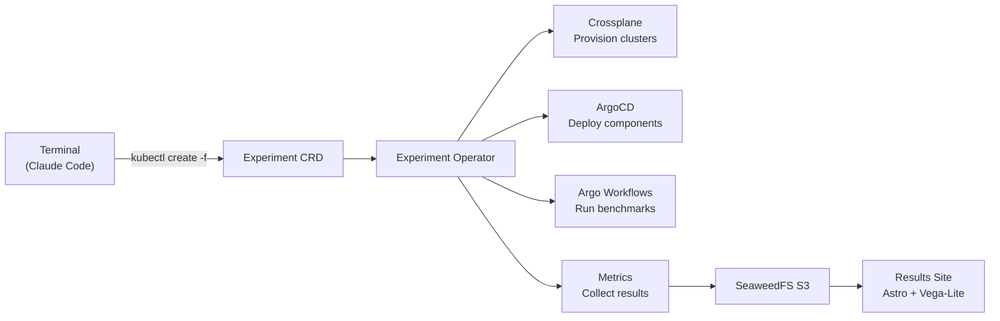
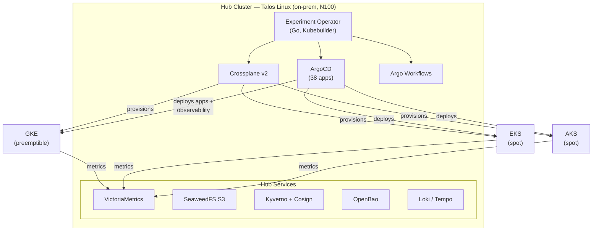
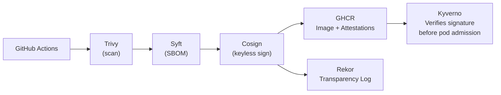

# k8s-ai-cloud-testbed

AI-driven Kubernetes benchmarking lab. A custom operator orchestrates experiments
across on-prem and cloud clusters, collects metrics, and publishes results — all
from a terminal conversation with Claude.

## How It Works



```bash
# Deploy an experiment
kubectl create -f experiments/tsdb-comparison/experiment.yaml

# Watch the lifecycle
kubectl get experiments -n experiments -w
# NAME                    PHASE          AGE
# tsdb-comparison-x7k2q   Provisioning   10s
# tsdb-comparison-x7k2q   Running        9m
# tsdb-comparison-x7k2q   Complete       25m
```

## Architecture



## Getting Started

### Prerequisites

| Requirement | Purpose |
|-------------|---------|
| **Talos Linux cluster** | Hub cluster (tested on Intel N100 mini-PC, 16 GB RAM) |
| **Terminal machine** | Any machine with network access to the Talos node (WSL, Linux, macOS) |
| **kubectl** | Kubernetes CLI |
| **talosctl** | Talos Linux management |
| **helm** | Initial ArgoCD install only — ArgoCD manages everything after bootstrap |
| **GCP/AWS/Azure credentials** | For Crossplane to provision experiment clusters (optional for hub-only use) |

### 1. Bootstrap the Hub

The hub cluster runs all control-plane services. Bootstrap is a three-step process —
after that, ArgoCD manages everything from Git.

```bash
# Install kube-vip (LoadBalancer support) and local-path-provisioner (storage)
kubectl apply -f platform/bootstrap/kube-vip.yaml
kubectl apply -f platform/bootstrap/local-path-provisioner.yaml

# Install ArgoCD via Helm (one-time — ArgoCD self-manages after this)
helm repo add argo https://argoproj.github.io/argo-helm
helm install argocd argo/argo-cd \
  --namespace argocd --create-namespace \
  --values platform/bootstrap/argocd-values-talos.yaml

# Apply the root app-of-apps — ArgoCD discovers and syncs all 38 child apps
kubectl apply -f platform/bootstrap/hub-application.yaml
```

Once applied, ArgoCD reads `platform/apps/` from this repo and deploys the full
stack: Crossplane, Kyverno, OpenBao, VictoriaMetrics, SeaweedFS, Argo Workflows,
the experiment operator, and everything else. Sync waves ensure correct ordering.

```bash
# Watch apps come up (~10 min for full convergence)
kubectl get applications -n argocd -w
```

### 2. Initialize Secrets

OpenBao stores all secrets centrally. External Secrets Operator syncs them to
Kubernetes secrets automatically.

```bash
# Initialize OpenBao (first time only)
kubectl exec -n openbao openbao-0 -- bao operator init \
  -key-shares=1 -key-threshold=1 -format=json > ~/.illmlab/openbao-keys.json

# Unseal
kubectl exec -n openbao openbao-0 -- bao operator unseal \
  $(jq -r '.unseal_keys_b64[0]' ~/.illmlab/openbao-keys.json)

# Store cloud credentials for Crossplane (GCP example)
kubectl exec -n openbao openbao-0 -- bao kv put secret/cloud/gcp \
  credentials=@~/.secrets/gcp-credentials.json
```

### 3. Run an Experiment

```bash
# Create (generateName gives a unique suffix each time)
kubectl create -f experiments/hello-app/experiment.yaml

# Watch: Pending → Provisioning → Ready → Running → Complete
kubectl get experiments -n experiments -w

# Check results
kubectl get experiments -n experiments -o wide   # Shows ResultsURL column
```

The operator handles the full lifecycle — provisioning cloud clusters, deploying
components via ArgoCD, running workflows, collecting metrics, and storing results
in SeaweedFS S3.

## Experiment Model

Two custom CRDs define the experiment system:

**Experiment** (namespaced) — what to run:
```yaml
spec:
  targets:
    - name: target
      cluster: { provider: gke, preemptible: true }
      components:
        - app: prometheus        # resolves to Component CRD
        - app: hello-app
  workflow: { template: experiment-lifecycle }
  metrics:
    queries:
      - name: p99_latency
        query: histogram_quantile(0.99, rate(http_duration_seconds_bucket[5m]))
```

**Component** (cluster-scoped) — reusable building blocks:
```yaml
spec:
  sources:
    helm: { repo: https://prometheus-community.github.io/helm-charts, chart: prometheus }
  parameters: { retention: 24h }
  observability: { serviceMonitor: true }
```

Lifecycle: `Pending → Provisioning → Ready → Running → Complete → Results (S3 + charts)`

## Project Structure

```
operators/experiment-operator/       Custom Go operator (Kubebuilder)
  internal/
    controller/                      Reconciliation loop
    crossplane/                      GKE/EKS/AKS cluster provisioning
    argocd/                          Application lifecycle + cluster registration
    components/                      ComponentRef → Git/Helm source resolution
    workflow/                        Argo Workflows integration
    metrics/                         Prometheus query collection
    storage/                         SeaweedFS S3 results storage
components/                          42 reusable components (8 categories)
experiments/                         15 experiment scenarios
platform/                            Hub cluster infra (38 ArgoCD apps)
docs/adrs/                           17 Architecture Decision Records
docs/roadmap/                        10 phases, ~50 target experiments
.github/workflows/                   SLSA build pipelines
```

## Supply Chain Security — SLSA Level 2



## Experiments

**Deployable now:** hello-app, prometheus-tutorial, loki-tutorial

**Scenarios defined:**

| Scenario | Focus |
|----------|-------|
| tsdb-comparison | Prometheus vs VictoriaMetrics (resource efficiency) |
| gateway-comparison | Envoy Gateway vs Kong vs Traefik |
| logging-comparison | Loki vs Elasticsearch (trade-offs) |
| tracing-comparison | Tempo vs Jaeger |
| otel-tutorial | Distributed tracing, OTLP, span correlation |
| slo-tutorial | Error budgets, multi-burn-rate alerts, Pyrra |
| observability-cost-tutorial | Cardinality, log volume, retention tuning |
| seaweedfs-tutorial | O(1) lookups, Haystack architecture |
| cicd-fundamentals | GitHub Actions + Cosign + SBOM |

15 scenarios across observability, traffic, security, and cost engineering.
Target: ~50 experiments across 10 phases.

## Roadmap

| Phase | Topic | Status |
|-------|-------|--------|
| 1 | Platform Bootstrap & GitOps | Complete |
| 2 | CI/CD & Supply Chain Security | Complete |
| 3 | Observability | In Progress |
| 4 | Traffic Management | In Progress |
| 5 | Data Persistence | Planned |
| 6 | Security & Policy | Planned |
| 7 | Service Mesh | Planned |
| 8 | Messaging & Events | Planned |
| 9 | Autoscaling & Resources | Planned |
| 10 | Performance & Cost Engineering | Planned |

[Full roadmap →](docs/roadmap/)

## Architecture Decisions

| ADR | Decision |
|-----|----------|
| [015](docs/adrs/ADR-015-experiment-operator.md) | Go operator over Crossplane XRD for experiment orchestration |
| [017](docs/adrs/ADR-017-benchmark-results-site.md) | GitHub Pages + Astro + Vega-Lite for benchmark results site |
| [016](docs/adrs/ADR-016-hub-metrics-backend.md) | VictoriaMetrics Single over Mimir for hub metrics backhaul |
| [007](docs/adrs/ADR-007-supply-chain-security.md) | Sigstore ecosystem for supply chain security |
| [013](docs/adrs/ADR-013-crossplane-v2-upgrade.md) | Crossplane v2 upgrade — Pipeline mode compositions |

17 ADRs document trade-offs with data. [All ADRs →](docs/adrs/)

## License

MIT
