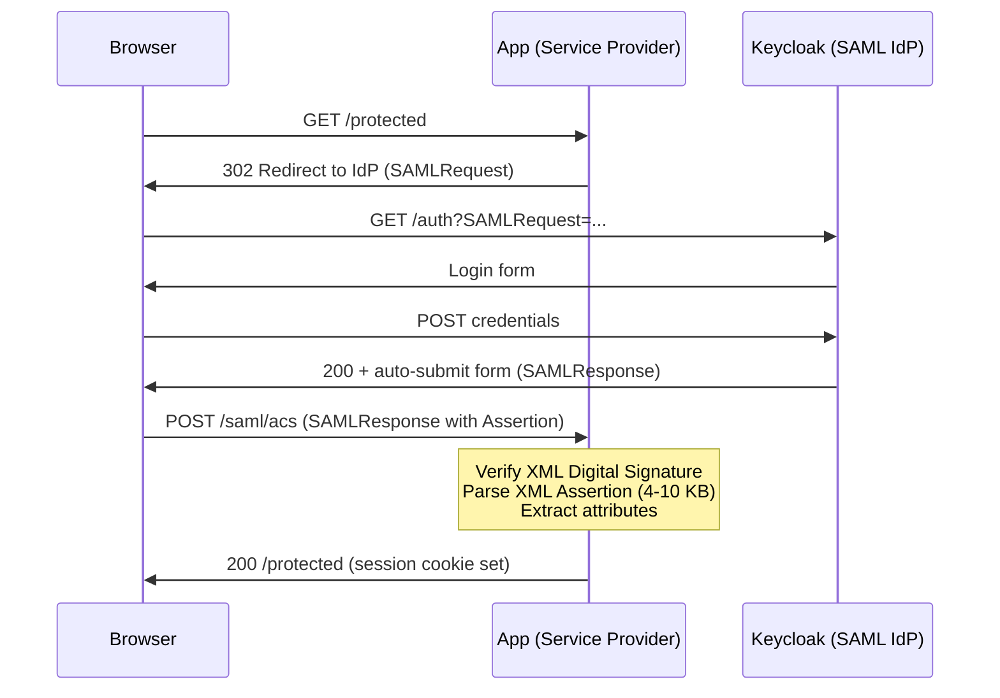
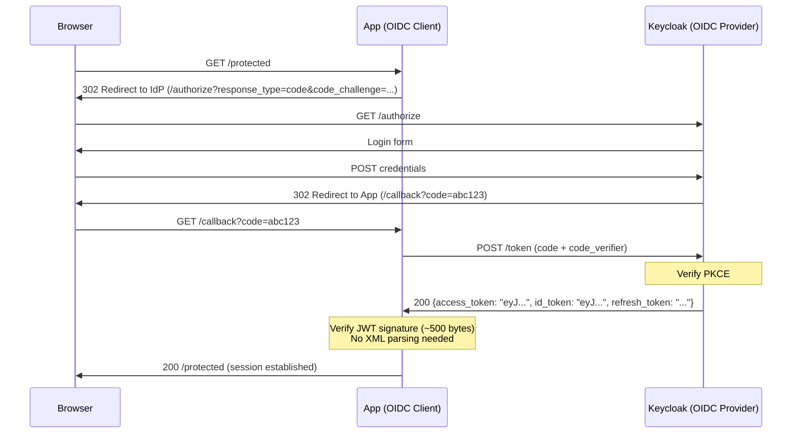

# Identity & Authentication Series Roadmap

*Experiment-focused roadmap for application-level identity, authentication, and authorization. 14 experiments: 4 interactive tutorials that tell the historical story (why SSO? why SAML? why OAuth+OIDC?) followed by 10 benchmark comparisons that quantify the costs. Each entry is scaffold-ready — enough detail to create the experiment YAML from.*

*This is distinct from Phase 3's infrastructure-level security (RBAC, admission control) and from [Appendix C: PKI & Certificates](appendix-pki-certs.md) which covers TLS/mTLS/cert-manager.*

---

## Series Overview

### Series Metadata

```json
{
  "id": "identity-and-auth",
  "name": "Identity & Authentication",
  "description": "Progressive exploration of identity infrastructure -- from the pre-SSO password problem through SAML and OAuth/OIDC protocol tutorials to quantitative benchmarks of IdPs, auth proxies, and authorization engines",
  "order": ["id-101", "id-102", "id-103", "id-104", "id-phb", "id-jwt", "id-oaf", "id-oidc", "id-saml", "id-idp", "id-prx", "id-sso", "id-mfa", "id-azp"],
  "color": "#e879f9"
}
```

**Naming convention:** All experiments use the `id-` prefix (identity). Tutorials use numeric IDs (`101`–`104`) for the story arc. Benchmarks use 2–4 character mnemonics: `phb` = password hashing benchmark, `jwt` = JWT signing, `oaf` = OAuth flows, etc.

**Color rationale:** `#e879f9` (fuchsia/violet-400) — visually distinct from the existing palette (purple `#a78bfa`, green `#34d399`, orange `#f97316`, blue `#38bdf8`). Security/identity is commonly associated with purple/violet tones in security tooling UIs.

### Narrative Arc

| Phase | Experiments | Type | Theme |
|-------|-------------|------|-------|
| 0. The Story | `id-101`, `id-102`, `id-103`, `id-104` | tutorial | Why SSO? Why SAML? Why OAuth+OIDC? Hands-on protocol walkthroughs |
| 1. Cryptographic Foundations | `id-phb`, `id-jwt` | comparison | Raw primitive performance — no IdP needed |
| 2. Protocol Internals | `id-oaf`, `id-oidc`, `id-saml` | comparison | OAuth/OIDC/SAML protocol benchmarks with Keycloak |
| 3. Infrastructure Comparison | `id-idp`, `id-prx`, `id-sso` | comparison | IdP vs IdP, proxy vs proxy, federation cost |
| 4. Advanced Capabilities | `id-mfa`, `id-azp` | comparison | MFA mechanism costs, authorization model shootout |

Phase 0 tutorials tell the historical story that motivates the benchmarks. They can be consumed as static educational content on the benchmark site, or as live hands-on walkthroughs with a running cluster.

### Appendix B.1–B.12 Coverage Matrix

| Appendix Section | Tutorial Coverage | Benchmark Coverage |
|-----------------|-------------------|-------------------|
| B.1 Password Management & Credential Storage | `id-101` (motivation) | `id-phb` (primary) |
| B.2 JWT Fundamentals & Internals | `id-104` (hands-on JWT inspection) | `id-jwt` (primary), `id-oidc` (validation) |
| B.3 JWE – JSON Web Encryption | — | `id-jwt` (JWE sub-benchmark) |
| B.4 OAuth 2.0 Flows | `id-104` (Authorization Code + PKCE walkthrough) | `id-oaf` (primary) |
| B.5 OpenID Connect (OIDC) | `id-104` (OIDC flow + ID token) | `id-oidc` (primary), `id-saml` (baseline), `id-sso` (federation) |
| B.6 Session Management | `id-101` (cookie sessions), `id-104` (token refresh) | `id-oaf` (refresh tokens), `id-prx` (session cookies), `id-mfa` |
| B.7 Identity Provider Deployment | `id-103` (Keycloak deployment + realm config) | `id-idp` (primary), `id-saml` (config), `id-sso` (brokering) |
| B.8 Application Integration Patterns | `id-104` (API bearer tokens) | `id-prx` (primary), `id-sso` (federation), `id-azp` (service-to-service) |
| B.9 Multi-Factor Authentication | — | `id-mfa` (primary) |
| B.10 Authorization Patterns | — | `id-azp` (primary) |
| B.11 Security Operations | — | Covered as security analysis sections in benchmark experiments |
| B.12 API Keys & PATs | — | Deferred — see [Future Work](#future-work) |

---

## Prerequisites

### New Component Category: `components/identity/`

| Component | Source | Description | Used By |
|-----------|--------|-------------|---------|
| `openldap` | Helm: `bitnami/openldap` or raw manifests | OpenLDAP directory server with pre-configured users/groups | `id-102` |
| `keycloak` | Helm: `bitnami/keycloak` (OCI registry) | Keycloak IdP with PostgreSQL. Params: realm config, SAML/OIDC client definitions | `id-103`+ |
| `keycloak-postgres` | Helm: `bitnami/postgresql` | PostgreSQL for Keycloak backend. Params: database name, credentials | `id-103`+ |
| `dex` | Helm: `dex/dex` (`https://charts.dexidp.io`) | Dex OIDC federation proxy. Params: static clients, connectors | `id-idp` |
| `oauth2-proxy` | Helm: `oauth2-proxy/oauth2-proxy` (`https://oauth2-proxy.github.io/manifests`) | OAuth2 reverse proxy. Params: OIDC provider URL, client ID/secret | `id-prx` |
| `pomerium` | Helm: `pomerium/pomerium` (`https://helm.pomerium.io`) | Identity-aware access proxy. Params: IdP config, routes, policies | `id-prx` |
| `opa` | Helm or raw manifests | Open Policy Agent for authorization decisions. Params: policy bundle | `id-azp` |
| `spicedb` | Helm: `authzed/spicedb` (`https://authzed.github.io/helm-charts`) | Zanzibar-style authorization. Params: schema, datastore config | `id-azp` |

### Tutorial Apps: `components/apps/`

| Component | Description | Used By |
|-----------|-------------|---------|
| `id-app-portal` | Simple web app with login form. Configurable auth backend: embedded SQLite, LDAP bind, SAML SP, or OIDC RP. Shows "Welcome, user" after login. | `id-101`–`id-104` |
| `id-app-dashboard` | Same pattern as portal, different branding. Demonstrates multi-app SSO (or lack thereof). | `id-101`–`id-104` |
| `id-app-wiki` | Same pattern, third app. Three apps make the SSO difference tangible. | `id-101`–`id-104` |
| `auth-resource-api` | Simple protected API (validates JWT bearer tokens, returns 200/401). Demonstrates what SAML can't do: API-level auth. | `id-104`, `id-oaf` |

The three tutorial apps (`id-app-*`) are a single codebase with a config flag that switches the auth backend. This lets the same app progress through the story: standalone → LDAP → SAML → OIDC.

### Benchmark Apps: `components/apps/`

| Component | Description | Used By |
|-----------|-------------|---------|
| `auth-hash-bench` | Password hashing benchmark service (Go). Exposes bcrypt/argon2id/scrypt/PBKDF2 endpoints with Prometheus histograms | `id-phb` |
| `auth-jwt-bench` | JWT sign/verify/encrypt benchmark service (Go). All algorithm families with histograms | `id-jwt` |
| `auth-oauth-bench` | OAuth flow benchmark client. Drives AuthCode+PKCE, Client Credentials, Device flows against an IdP | `id-oaf` |
| `auth-oidc-validator` | OIDC token validation benchmark. Three strategies: local JWKS, introspection, UserInfo | `id-oidc` |
| `auth-saml-sp` | SAML Service Provider with instrumented assertion parsing and XML signature verification | `id-saml` |
| `auth-idp-bench` | IdP benchmark client. Authenticates against both Keycloak and Dex, measures token issuance | `id-idp` |
| `auth-mfa-bench` | MFA benchmark client. Simulates TOTP code generation and WebAuthn ceremonies | `id-mfa` |
| `auth-authz-bench` | Authorization benchmark API. Three backends: in-process RBAC, OPA sidecar, SpiceDB | `id-azp` |

All apps are CI-built as container images, following the existing `components/apps/` pattern.

### Load Testing: `components/testing/`

| Component | Description |
|-----------|-------------|
| `k6-auth-loadtest` | k6 load test scripts for auth experiments. Configurable scenarios for each experiment type |

### Domain Taxonomy Addition

Add to `site/data/_categories.json`:

```json
{
  "id": "identity",
  "name": "Identity & Auth",
  "description": "Authentication, authorization, SSO, IdP deployment, and identity federation",
  "subdomains": ["authentication", "authorization", "federation", "idp"]
}
```

Tag-to-domain mappings to add in `site/src/lib/experiments.ts`:

| Tag | Domain | Subdomain |
|-----|--------|-----------|
| `authentication`, `oauth`, `oidc`, `saml`, `jwt`, `sso`, `mfa`, `password-hashing` | `identity` | `authentication` |
| `authorization`, `rbac`, `abac`, `rebac`, `opa` | `identity` | `authorization` |
| `keycloak`, `dex`, `idp` | `identity` | `idp` |
| `identity-brokering`, `identity-federation` | `identity` | `federation` |
| `identity` | `identity` | — |

### Secrets in OpenBao

| OpenBao Path | Purpose |
|-------------|---------|
| `secret/experiments/keycloak-admin` | Keycloak admin credentials for realm configuration |
| `secret/experiments/oidc-client` | Shared OIDC client ID and secret for test apps |
| `secret/experiments/saml-keystore` | SAML signing certificate and key for SP/IdP |

Synced via ExternalSecret to the `experiments` namespace, following the existing pattern in `platform/manifests/external-secrets-config/`.

### Keycloak Realm Configuration

Experiments 3–9 share a reusable Kubernetes Job that configures Keycloak via its Admin REST API. The Job reads from a ConfigMap containing:

- Realm export JSON (realm name, token settings, login settings)
- Client definitions (confidential and public)
- Test users with pre-set passwords
- SAML SP metadata (experiment 5)
- Identity brokering configuration (experiment 8)

Deployed via ArgoCD sync waves:

1. **Wave 0:** PostgreSQL
2. **Wave 1:** Keycloak (depends on PostgreSQL)
3. **Wave 2:** Realm configuration Job
4. **Wave 3:** Application components (bench apps)
5. **Wave 4:** Load generator

---

## Tutorial UX Model

Identity tutorials serve two audiences in two modes:

### Static Mode (no cluster needed)

The benchmark site renders tutorial content as a self-contained walkthrough — step-by-step instructions with flow diagrams (Mermaid), code samples (Shiki-highlighted), annotated screenshots, and protocol trace examples. A user reads through the tutorial and understands the concepts without deploying anything.

This requires extending the site's `BodyBlock` system with:

| New Block Type | Purpose |
|---------------|---------|
| `step` | Numbered, ordered tutorial step with title and nested content blocks. Renders as a card with step number badge. Optional `localStorage`-backed completion checkbox. |
| `markdown` | Prose rendered as HTML via markdown-to-HTML transform (`set:html`). Enables inline code, bold, links, lists — currently all prose is plain text. |
| `terminal` | Static terminal mockup showing commands and expected output. Styled like a terminal window (dark background, monospace). Not interactive in static mode. |
| `protocolTrace` | Visual representation of an HTTP redirect flow (SP → IdP → SP) showing each hop, headers, and payloads. Specific to auth protocol tutorials. |

Tutorial experiments publish to `site/data/` like comparisons, but with a `tutorial` tag instead of `comparison`. The `ExperimentDetail` component conditionally renders tutorial steps (from `analysis.body` using `step` blocks) instead of the metrics/chart sections.

### Live Mode (cluster running)

When the user runs the experiment (`kubectl create -f experiments/id-101/experiment.yaml`), the tutorial gains live interactivity:

- **Ephemeral service links** — `tutorial.services` entries become clickable URLs to Keycloak admin console, web apps, etc. The site can render these as callout blocks with a "requires running cluster" indicator.
- **Interactive terminal** — `labctl tutorial <name>` renders the tutorial with checkpoint validation. Future: `xterm.js` web terminal component for in-browser shell access.
- **Live protocol inspection** — browser dev tools (Network tab) show actual redirects, SAML assertions, JWT tokens in real-time.

Progressive enhancement: static content is always available; live features activate when a cluster is detected.

### Tutorial Experiment Structure

Each tutorial has two files:

```
experiments/id-101/
├── experiment.yaml    # CRD: components, tutorial.services, completion.mode: manual
└── tutorial.yaml      # Structured content: modules, checkpoints, learning objectives
```

The `tutorial.yaml` uses the SLO-tutorial structured format (modules with checkpoints and validation) rather than the Loki-tutorial free-form format, because identity tutorials need explicit checkpoint validation ("Did you see the SAML assertion? Did you decode the JWT?").

### Site Changes Required

| Change | File | Description |
|--------|------|-------------|
| New block types | `site/src/types.ts` | Add `step`, `markdown`, `terminal`, `protocolTrace` to `BodyBlock` union |
| Block renderers | `site/src/components/AnalysisBody.astro` | New `StepCard.astro`, `TerminalBlock.astro`, `ProtocolTrace.astro` components |
| Markdown rendering | `site/src/lib/` | Add `marked` or `remark` dependency for `markdown` block HTML transform |
| Tutorial publish path | operator / manual | Tutorials publish a JSON to `site/data/` with step content in `analysis.body` |
| Conditional rendering | `site/src/components/ExperimentDetail.astro` | Suppress metrics/charts sections for tutorial-type experiments |
| Tutorial listing | `site/src/pages/` | Optional `/tutorials/` index page grouping all tutorial experiments |

These site changes are a separate implementation milestone — tutorials can be scaffolded and run via `labctl` before the site rendering is built.

---

## Phase 0: The Story (Tutorials)

### id-101 — The Identity Problem

**Title:** Why SSO? The Multi-App Password Problem

**Type:** `tutorial`

**Description:** Deploy three simple web applications, each with its own independent user database. Walk through creating separate accounts, logging in separately, and experiencing the friction that drove the entire identity industry. This is the problem that existed before SAML, before OAuth, before any federated identity — and it's still the default for most homegrown apps today.

**The story this tells:** In the 1990s, every application managed its own credentials. An employee with 15 internal apps had 15 passwords. IT had 15 user databases to manage. When someone was fired, 15 accounts had to be disabled. When a password was breached on one app, password reuse meant all apps were compromised. This tutorial makes you *feel* that pain.

**What you experience:**
1. Create an account on App A (portal). Log in. See "Welcome, user."
2. Navigate to App B (dashboard). You're not logged in — create another account with the same username and a different password.
3. Navigate to App C (wiki). Same thing — another account.
4. Log out of App A. Apps B and C are unaffected — no centralized session.
5. Try to answer: "How would IT disable this user's access across all apps?"

**What you observe:**
- Each app stores passwords independently (inspect the databases)
- No single point of identity management
- No SSO — logging in to one app says nothing about the others
- Password reuse is the only "convenience" — and it's a security disaster

**Deploys:**
- 3 simple web apps (`id-app-portal`, `id-app-dashboard`, `id-app-wiki`) — each with embedded SQLite user database, basic login form, session cookie
- No IdP, no shared directory, no federation

**Capability matrix:**

| Capability | Status |
|-----------|--------|
| Single Sign-On | No |
| Centralized user management | No |
| Single point of revocation | No |
| Password not exposed to apps | No (each app sees plaintext password at login) |
| Works cross-domain | N/A (no federation to evaluate) |
| API-friendly (tokens in headers) | No (cookie-based sessions only) |

**Tags:** `tutorial`, `identity`, `authentication`

**GKE sizing:** `e2-small`, 1 node (minimal — just 3 tiny apps)

**Prerequisites:** None

**Appendix coverage:** Motivates all of B.1–B.12

---

### id-102 — LDAP Centralization

**Title:** One Directory, Still No SSO: LDAP Authentication

**Type:** `tutorial`

**Description:** Deploy OpenLDAP as a central directory and reconfigure the three apps to authenticate against it instead of their own databases. You now have one password and one place to manage users — but you still type that password into every app separately. This tutorial shows why a centralized directory is necessary but not sufficient for SSO.

**The story this tells:** LDAP (1993) and Active Directory solved the "15 databases" problem by centralizing identity storage. Every app asks the same directory "is this password correct?" But the user's password still crosses the network for every app. There's no "logged in" state that carries across apps. And LDAP only works inside the corporate network — Salesforce can't bind to your LDAP server.

**What you experience:**
1. Deploy OpenLDAP with pre-configured users (alice, bob, admin)
2. All three apps now authenticate against LDAP — one password works everywhere
3. Log in to App A. Navigate to App B — you're not logged in. Type the same password again.
4. Disable a user in LDAP. They're locked out of all three apps immediately. (Progress!)
5. But: each app still receives the raw password. Inspect the LDAP bind request.

**What you observe:**
- Centralized user store (add/remove users in one place)
- Password still typed into every app (no SSO)
- Password transmitted to every app, then to LDAP (multiple network hops)
- Only works within network reach of the LDAP server (no cross-org federation)

**Deploys:**
- `openldap` — OpenLDAP server with pre-configured directory (users, groups)
- 3 web apps (same as id-101, reconfigured for LDAP bind authentication)

**Capability matrix:**

| Capability | id-101 | id-102 (LDAP) |
|-----------|--------|---------------|
| Single Sign-On | No | No |
| Centralized user management | No | **Yes** |
| Single point of revocation | No | **Yes** |
| Password not exposed to apps | No | No (apps see password for LDAP bind) |
| Works cross-domain | N/A | No (network-local only) |
| API-friendly | No | No |

**Tags:** `tutorial`, `identity`, `authentication`, `ldap`

**GKE sizing:** `e2-small`, 1 node

**Prerequisites:** `id-101` (same apps, reconfigured)

**Appendix coverage:** Context for B.7 (IdP deployment), B.1 (credential storage)

---

### id-103 — SAML SSO

**Title:** Real Single Sign-On: SAML 2.0 with Keycloak

**Type:** `tutorial`

**Description:** Deploy Keycloak as a SAML Identity Provider and configure the apps as SAML Service Providers. For the first time, log in once and access all apps without re-entering credentials. Walk through the SAML flow step-by-step: inspect the XML assertion, see the browser redirects, decode the XML digital signature. Understand why SAML was the standard for enterprise SSO from 2005 to ~2015.

**The story this tells:** SAML (2002/2005) was the first widely-adopted, vendor-neutral, HTTP-based federated identity protocol. It solved the cross-domain SSO problem that LDAP and Kerberos couldn't: an app on `salesforce.com` can now ask an IdP on `company.com` "who is this person?" and get a cryptographically signed answer through the browser. SAML uses XML because that was the interoperability format of 2002 — JSON wasn't formalized until 2006.

**What you experience:**
1. Deploy Keycloak with a realm, users, and SAML client configurations for all three apps
2. Access App A — you're redirected to Keycloak login. Authenticate once.
3. Access App B — **no login prompt**. You're already authenticated. This is SSO.
4. Open browser dev tools (Network tab) — see the redirects: app → Keycloak → app
5. Find the SAML assertion in the POST-back. Base64-decode it. See the XML:
   - `<saml:Assertion>` with issuer, subject, conditions, attribute statements
   - `<ds:Signature>` with XML digital signature (RSA-SHA256)
   - Observe the size: 4–10 KB of XML for what is essentially "this is alice, she's in group engineering"
6. Log out of Keycloak — Single Logout propagates to all apps

**What you observe:**
- True SSO — one login, access everywhere
- Browser redirects carry the protocol (HTTP-Redirect and HTTP-POST bindings)
- SAML assertions are large XML documents with embedded digital signatures
- XML digital signature verification is required at every SP on every assertion
- The IdP (Keycloak) is the single source of truth — revoke access in one place
- Works cross-domain (browser-mediated, no direct network access needed between SP and IdP)

**Deploys:**
- `keycloak` + `keycloak-postgres` — IdP with SAML realm configuration
- 3 web apps (reconfigured as SAML Service Providers using a SAML library)
- Realm configuration Job (creates realm, SAML clients, test users)

**Capability matrix:**

| Capability | id-101 | id-102 (LDAP) | id-103 (SAML) |
|-----------|--------|---------------|---------------|
| Single Sign-On | No | No | **Yes** |
| Centralized user management | No | Yes | **Yes** |
| Single point of revocation | No | Yes | **Yes** |
| Password not exposed to apps | No | No | **Yes** (only IdP sees password) |
| Works cross-domain | N/A | No | **Yes** |
| API-friendly | No | No | **No** (XML assertions, browser-only) |

**Protocol flow to inspect:**



**Tags:** `tutorial`, `identity`, `authentication`, `saml`, `keycloak`, `sso`

**GKE sizing:** `e2-standard-4`, 2 nodes (Keycloak + PostgreSQL need memory)

**Prerequisites:** `id-102` (same apps, reconfigured for SAML)

**Appendix coverage:** B.7 (IdP deployment), B.5 (OIDC comparison baseline set here)

---

### id-104 — OAuth 2.0 + OIDC SSO

**Title:** The Modern Stack: OAuth 2.0 + OpenID Connect with Keycloak

**Type:** `tutorial`

**Description:** Reconfigure the same Keycloak instance to serve OIDC (instead of SAML) and reconfigure the apps as OIDC Relying Parties. Walk through the Authorization Code + PKCE flow, inspect the compact JWT ID token (vs the SAML assertion), and see why the industry shifted to OIDC. Then demonstrate what SAML can't do: attach the token to an API call.

**The story this tells:** Two things changed between 2005 and 2014 that broke SAML's assumptions: (1) the iPhone (2007) and mobile apps can't do browser redirects with XML POST-backs, and (2) the API economy — services talk to services via REST APIs, not browser forms. OAuth 2.0 (2012) solved delegated API authorization. OIDC (2014) added an identity layer on top. The key innovation: the ID token is a compact JWT (~500 bytes of JSON) that fits in an HTTP `Authorization` header. SAML assertions (4-10 KB of XML) don't.

**What you experience:**
1. Keycloak is already running from id-103. Configure OIDC clients alongside the existing SAML clients.
2. Access App A via OIDC — redirected to Keycloak, same login, but now the response is different
3. Open browser dev tools — see the Authorization Code in the redirect URL
4. Inspect the token exchange (code → access token + ID token). Decode the JWT:
   - Header: `{"alg": "RS256", "typ": "JWT", "kid": "..."}`
   - Payload: `{"sub": "alice", "iss": "https://keycloak...", "aud": "app-a", "exp": ...}`
   - Signature: 86 bytes of base64
   - **Total size: ~500 bytes** vs the 4-10 KB SAML assertion
5. Use the access token to call an API directly:
   ```bash
   curl -H "Authorization: Bearer eyJhbG..." http://api-server/protected
   ```
   This is impossible with SAML — the assertion is too large for a header and requires browser mediation.
6. Side-by-side: the same Keycloak instance, the same users, SAML vs OIDC

**What you observe:**
- Same SSO experience as SAML from the user's perspective
- JWT is ~20x smaller than SAML assertion
- No XML parsing, no XML digital signature verification — just a fast HMAC or RSA signature check
- Token works in HTTP headers → APIs, mobile apps, SPAs, CLI tools, not just browsers
- PKCE protects against code interception (no client secret needed for public clients)
- OIDC Discovery (`.well-known/openid-configuration`) enables auto-configuration

**Deploys:**
- Same `keycloak` + `keycloak-postgres` from id-103
- 3 web apps (reconfigured as OIDC Relying Parties)
- `auth-resource-api` — a simple protected API that validates JWT bearer tokens
- Realm configuration Job (adds OIDC clients to existing realm)

**Capability matrix (cumulative):**

| Capability | id-101 | id-102 (LDAP) | id-103 (SAML) | id-104 (OIDC) |
|-----------|--------|---------------|---------------|---------------|
| Single Sign-On | No | No | Yes | **Yes** |
| Centralized user management | No | Yes | Yes | **Yes** |
| Single point of revocation | No | Yes | Yes | **Yes** |
| Password not exposed to apps | No | No | Yes | **Yes** |
| Works cross-domain | N/A | No | Yes | **Yes** |
| API-friendly (tokens in headers) | No | No | No | **Yes** |
| Works for mobile/SPA/CLI | No | No | No | **Yes** |
| Compact tokens (<1 KB) | N/A | N/A | No (4-10 KB XML) | **Yes (~500 B)** |
| Auto-discovery/configuration | N/A | N/A | No (manual metadata) | **Yes (.well-known)** |

**Protocol flow to inspect:**



**Tags:** `tutorial`, `identity`, `authentication`, `oauth`, `oidc`, `keycloak`, `sso`, `jwt`

**GKE sizing:** `e2-standard-4`, 2 nodes (reuses Keycloak from id-103)

**Prerequisites:** `id-103` (Keycloak already deployed, adds OIDC alongside SAML)

**Appendix coverage:** B.4 (OAuth flows), B.5 (OIDC), B.2 (JWT fundamentals)

---

## Phase 1: Cryptographic Foundations

### id-phb — Password Hashing Algorithm Benchmark

**Title:** Password Hashing Showdown: bcrypt vs Argon2id vs scrypt vs PBKDF2

**Description:** Benchmarks the four major password hashing algorithms across multiple cost parameters to measure the latency/security tradeoff. Answers "how much does recommended-strength hashing actually cost?" with hard numbers on hash time, verify time, throughput, and resource consumption.

**Hypothesis:** Argon2id at 128 MiB memory cost will produce hash times within 2x of bcrypt cost-12, but consume 10x more memory, making it the recommended choice for security-critical systems where memory is available, while PBKDF2 at NIST-recommended 600K iterations will be the fastest but least resistant to GPU-based attacks.

**Deploys:**
- `auth-hash-bench` — custom Go service exposing endpoints per algorithm, instrumented with Prometheus histograms
- `k6-auth-loadtest` — concurrent hash/verify requests at varying work-factor parameters
- `kube-prometheus-stack`, `metrics-agent`, `metrics-egress`

**Key metrics:**

| Name | Query | Type | Unit | Group |
|------|-------|------|------|-------|
| `bcrypt_hash_p99` | `histogram_quantile(0.99, sum(rate(auth_hash_duration_seconds_bucket{algorithm="bcrypt",operation="hash",namespace=~"$EXPERIMENT"}[$DURATION])) by (le,cost))` | instant | seconds | bcrypt |
| `argon2_hash_p99` | `histogram_quantile(0.99, sum(rate(auth_hash_duration_seconds_bucket{algorithm="argon2id",operation="hash",namespace=~"$EXPERIMENT"}[$DURATION])) by (le,memory_mib))` | instant | seconds | argon2 |
| `hash_throughput_by_algorithm` | `sum(rate(auth_hash_operations_total{operation="hash",namespace=~"$EXPERIMENT"}[$DURATION])) by (algorithm)` | instant | ops/s | throughput |
| `hash_cpu_by_algorithm` | `sum(rate(container_cpu_usage_seconds_total{namespace=~"$EXPERIMENT",container="auth-hash-bench"}[5m])) by (pod)` | range | cores | resources |
| `hash_memory_by_algorithm` | `max(container_memory_working_set_bytes{namespace=~"$EXPERIMENT",container="auth-hash-bench"}) by (pod)` | range | bytes | resources |

**Tags:** `comparison`, `identity`, `authentication`, `password-hashing`

**GKE sizing:** `e2-standard-8` (Argon2id at 256 MiB memory cost needs headroom), 2 nodes

**Prerequisites:** None — no external infrastructure needed

**Appendix coverage:** B.1

---

### id-jwt — JWT Signing Algorithm Benchmark

**Title:** JWT Signing Speed: HMAC vs RSA vs ECDSA vs EdDSA

**Description:** Benchmarks JWT sign/verify operations across all major algorithm families (HS256, RS256, ES256, Ed25519, PS256), plus JWE encrypt/decrypt overhead for nested sign-then-encrypt tokens. Measures token size differences that affect HTTP header overhead.

**Hypothesis:** EdDSA (Ed25519) will deliver the lowest sign+verify combined latency among asymmetric algorithms and the smallest token size, while HMAC (HS256) remains fastest overall but requires shared secret distribution.

**Deploys:**
- `auth-jwt-bench` — JWT token service exposing sign/verify/encrypt endpoints per algorithm, with histogram instrumentation
- `k6-auth-loadtest`
- `kube-prometheus-stack`, `metrics-agent`, `metrics-egress`

**Key metrics:**

| Name | Query | Type | Unit | Group |
|------|-------|------|------|-------|
| `hs256_sign_p99` | `histogram_quantile(0.99, sum(rate(auth_jwt_operation_seconds_bucket{algorithm="HS256",operation="sign",namespace=~"$EXPERIMENT"}[$DURATION])) by (le))` | instant | seconds | hmac |
| `es256_verify_p99` | `histogram_quantile(0.99, sum(rate(auth_jwt_operation_seconds_bucket{algorithm="ES256",operation="verify",namespace=~"$EXPERIMENT"}[$DURATION])) by (le))` | instant | seconds | ecdsa |
| `token_size_by_algorithm` | `avg(auth_jwt_token_size_bytes{namespace=~"$EXPERIMENT"}) by (algorithm)` | instant | bytes | size |
| `jwe_encrypt_overhead_p99` | `histogram_quantile(0.99, sum(rate(auth_jwt_operation_seconds_bucket{operation="encrypt",namespace=~"$EXPERIMENT"}[$DURATION])) by (le,algorithm))` | instant | seconds | jwe |
| `sign_throughput_by_algorithm` | `sum(rate(auth_jwt_operations_total{operation="sign",namespace=~"$EXPERIMENT"}[$DURATION])) by (algorithm)` | instant | ops/s | throughput |

**Tags:** `comparison`, `identity`, `authentication`, `jwt`

**GKE sizing:** `e2-standard-4`, 2 nodes

**Prerequisites:** None — no external infrastructure needed

**Appendix coverage:** B.2, B.3

---

## Phase 2: Protocol Internals

### id-oaf — OAuth 2.0 Flow Latency Benchmark

**Title:** OAuth 2.0 Grant Type Latencies: Authorization Code vs Client Credentials vs Device Flow

**Description:** Measures end-to-end flow completion time for each major OAuth 2.0 grant type using Keycloak as the authorization server. Benchmarks token exchange, client credentials under concurrency, and token refresh — the operations that happen on every API call in a real system.

**Hypothesis:** Client Credentials grant will complete in under 5 ms p99 (no redirect, no user context), while Authorization Code + PKCE will cost 50–200 ms due to redirect round-trips. Token refresh will match client credentials latency since it is a direct token exchange.

**Deploys:**
- `keycloak` + `keycloak-postgres` — authorization server
- `auth-oauth-bench` — OAuth client implementing AuthCode+PKCE, Client Credentials, and Device Authorization flows
- `auth-resource-api` — simulated resource server that validates tokens
- `k6-auth-loadtest`
- `kube-prometheus-stack`, `metrics-agent`, `metrics-egress`

**Key metrics:**

| Name | Query | Type | Unit | Group |
|------|-------|------|------|-------|
| `authcode_flow_p99` | `histogram_quantile(0.99, sum(rate(auth_oauth_flow_duration_seconds_bucket{flow="authorization_code",namespace=~"$EXPERIMENT"}[$DURATION])) by (le))` | instant | seconds | authcode |
| `client_credentials_p99` | `histogram_quantile(0.99, sum(rate(auth_oauth_flow_duration_seconds_bucket{flow="client_credentials",namespace=~"$EXPERIMENT"}[$DURATION])) by (le))` | instant | seconds | client_creds |
| `token_refresh_p99` | `histogram_quantile(0.99, sum(rate(auth_oauth_flow_duration_seconds_bucket{flow="refresh",namespace=~"$EXPERIMENT"}[$DURATION])) by (le))` | instant | seconds | refresh |
| `keycloak_cpu` | `sum(rate(container_cpu_usage_seconds_total{namespace=~"$EXPERIMENT",pod=~"keycloak.*",container!="POD",container!=""}[5m]))` | range | cores | idp_resources |
| `keycloak_memory` | `sum(container_memory_working_set_bytes{namespace=~"$EXPERIMENT",pod=~"keycloak.*",container!="POD",container!=""})` | range | bytes | idp_resources |
| `oauth_error_rate` | `sum(rate(auth_oauth_errors_total{namespace=~"$EXPERIMENT"}[$DURATION])) by (flow,error_type)` | instant | errors/s | errors |

**Tags:** `comparison`, `identity`, `authentication`, `oauth`, `keycloak`

**GKE sizing:** `e2-standard-4`, 2 nodes

**Prerequisites:** Keycloak component must exist in `components/identity/`

**Appendix coverage:** B.4, B.6

---

### id-oidc — OIDC Discovery and Token Validation Benchmark

**Title:** OIDC Token Validation: Local JWKS vs Introspection vs UserInfo Endpoint

**Description:** Compares three OIDC token validation strategies at the resource server: local JWKS-cached signature verification (fastest, but misses revocations), token introspection endpoint (real-time revocation at the cost of IdP load), and UserInfo endpoint fetch (most complete claims, highest latency). Measures the trade-off between validation speed and revocation awareness.

**Hypothesis:** Local JWKS validation will be 100x+ faster than introspection (sub-millisecond vs network round-trip) and impose zero load on the IdP, but will miss revoked tokens until the JWKS TTL expires. Introspection provides real-time revocation at the cost of making the IdP a throughput bottleneck.

**Deploys:**
- `keycloak` + `keycloak-postgres`
- `auth-oidc-validator` — resource server implementing all three validation strategies
- `k6-auth-loadtest` — sends pre-authenticated requests with valid tokens
- `kube-prometheus-stack`, `metrics-agent`, `metrics-egress`

**Key metrics:**

| Name | Query | Type | Unit | Group |
|------|-------|------|------|-------|
| `local_jwks_validation_p99` | `histogram_quantile(0.99, sum(rate(auth_oidc_validation_seconds_bucket{strategy="local_jwks",namespace=~"$EXPERIMENT"}[$DURATION])) by (le))` | instant | seconds | local_jwks |
| `introspection_validation_p99` | `histogram_quantile(0.99, sum(rate(auth_oidc_validation_seconds_bucket{strategy="introspection",namespace=~"$EXPERIMENT"}[$DURATION])) by (le))` | instant | seconds | introspection |
| `userinfo_validation_p99` | `histogram_quantile(0.99, sum(rate(auth_oidc_validation_seconds_bucket{strategy="userinfo",namespace=~"$EXPERIMENT"}[$DURATION])) by (le))` | instant | seconds | userinfo |
| `jwks_cache_hit_rate` | `sum(rate(auth_oidc_jwks_cache_hits_total{namespace=~"$EXPERIMENT"}[$DURATION])) / sum(rate(auth_oidc_jwks_lookups_total{namespace=~"$EXPERIMENT"}[$DURATION]))` | instant | ratio | cache |
| `validation_throughput_by_strategy` | `sum(rate(auth_oidc_validations_total{namespace=~"$EXPERIMENT"}[$DURATION])) by (strategy)` | instant | ops/s | throughput |

**Tags:** `comparison`, `identity`, `authentication`, `oidc`, `keycloak`

**GKE sizing:** `e2-standard-4`, 2 nodes

**Prerequisites:** `id-oaf` (Keycloak deployment pattern established)

**Appendix coverage:** B.5, B.2

---

### id-saml — SAML 2.0 Protocol Performance Benchmark

**Title:** SAML 2.0 SSO: Assertion Processing, XML Signature Cost, and Redirect Latency

**Description:** Benchmarks SAML 2.0 SSO flows side-by-side with OIDC to quantify the protocol overhead difference. Measures SAML-specific costs: XML digital signature creation/verification, assertion serialization, and payload size compared to compact JWTs. Uses Keycloak configured as both SAML IdP and OIDC provider for a controlled comparison.

**Hypothesis:** SAML SSO flows will incur 2–5x higher end-to-end latency than OIDC due to XML serialization, XML digital signature computation, and larger assertion payloads (4–10 KB vs 500-byte JWT). SAML XML signature verification on the SP side will be the dominant cost, not the redirect round-trips.

**Deploys:**
- `keycloak` + `keycloak-postgres` — configured as both SAML IdP and OIDC provider
- `auth-saml-sp` — SAML service provider with instrumented assertion parsing and XML signature verification
- OIDC counterpart app for side-by-side comparison
- `k6-auth-loadtest`
- `kube-prometheus-stack`, `metrics-agent`, `metrics-egress`

**Key metrics:**

| Name | Query | Type | Unit | Group |
|------|-------|------|------|-------|
| `saml_assertion_gen_p99` | `histogram_quantile(0.99, sum(rate(auth_saml_assertion_duration_seconds_bucket{operation="generate",namespace=~"$EXPERIMENT"}[$DURATION])) by (le))` | instant | seconds | saml_idp |
| `saml_xml_signature_verify_p99` | `histogram_quantile(0.99, sum(rate(auth_saml_assertion_duration_seconds_bucket{operation="verify_signature",namespace=~"$EXPERIMENT"}[$DURATION])) by (le))` | instant | seconds | saml_sp |
| `saml_sso_flow_p99` | `histogram_quantile(0.99, sum(rate(auth_sso_flow_duration_seconds_bucket{protocol="saml",namespace=~"$EXPERIMENT"}[$DURATION])) by (le))` | instant | seconds | sso_flow |
| `oidc_sso_flow_p99` | `histogram_quantile(0.99, sum(rate(auth_sso_flow_duration_seconds_bucket{protocol="oidc",namespace=~"$EXPERIMENT"}[$DURATION])) by (le))` | instant | seconds | sso_flow |
| `saml_assertion_size` | `avg(auth_saml_assertion_size_bytes{namespace=~"$EXPERIMENT"})` | instant | bytes | payload_size |
| `oidc_id_token_size` | `avg(auth_oidc_token_size_bytes{namespace=~"$EXPERIMENT"})` | instant | bytes | payload_size |
| `saml_xml_parse_p99` | `histogram_quantile(0.99, sum(rate(auth_saml_xml_parse_duration_seconds_bucket{namespace=~"$EXPERIMENT"}[$DURATION])) by (le))` | instant | seconds | saml_sp |
| `keycloak_cpu_saml_vs_oidc` | `sum(rate(container_cpu_usage_seconds_total{namespace=~"$EXPERIMENT",pod=~"keycloak.*",container!="POD",container!=""}[5m]))` | range | cores | idp_resources |

**Tags:** `comparison`, `identity`, `authentication`, `saml`, `oidc`, `keycloak`

**GKE sizing:** `e2-standard-4`, 2 nodes

**Prerequisites:** `id-oaf` (Keycloak deployment pattern established)

**Appendix coverage:** B.7 (SAML brokering), B.5 (OIDC comparison baseline)

---

## Phase 3: Infrastructure Comparison

### id-idp — Identity Provider Comparison: Keycloak vs Dex

**Title:** IdP Shootout: Keycloak vs Dex — Resource Footprint, Startup, and Token Throughput

**Description:** Head-to-head comparison of a full-featured IdP (Keycloak with PostgreSQL) vs a lightweight federation proxy (Dex, stateless). Measures cold start time, idle resource footprint, token issuance throughput under load (50/100/200 concurrent users), and the resource cost of Keycloak's richer feature set (user federation, admin UI, fine-grained authorization).

**Hypothesis:** Dex will use 5–10x less memory than Keycloak at idle (50–100 MB vs 500+ MB due to JVM) and start 10x faster, but Keycloak will deliver higher sustained token throughput due to session caching and connection pooling. Including PostgreSQL, Keycloak's total footprint will be 3–5x larger.

**Deploys:**
- `keycloak` + `keycloak-postgres`
- `dex` — with static configuration, identical OIDC client registrations
- `auth-idp-bench` — shared test client authenticating against both IdPs
- `k6-auth-loadtest`
- `kube-prometheus-stack`, `metrics-agent`, `metrics-egress`

**Key metrics:**

| Name | Query | Type | Unit | Group |
|------|-------|------|------|-------|
| `keycloak_startup_time` | `auth_idp_startup_seconds{idp="keycloak",namespace=~"$EXPERIMENT"}` | instant | seconds | startup |
| `dex_startup_time` | `auth_idp_startup_seconds{idp="dex",namespace=~"$EXPERIMENT"}` | instant | seconds | startup |
| `keycloak_idle_cpu` | `avg_over_time(sum(rate(container_cpu_usage_seconds_total{namespace=~"$EXPERIMENT",pod=~"keycloak.*",container!="POD",container!=""}[5m]))[5m:])` | instant | cores | idle |
| `dex_idle_cpu` | `avg_over_time(sum(rate(container_cpu_usage_seconds_total{namespace=~"$EXPERIMENT",pod=~"dex.*",container!="POD",container!=""}[5m]))[5m:])` | instant | cores | idle |
| `keycloak_token_throughput` | `sum(rate(auth_idp_token_issuance_total{idp="keycloak",namespace=~"$EXPERIMENT"}[$DURATION]))` | instant | ops/s | throughput |
| `dex_token_throughput` | `sum(rate(auth_idp_token_issuance_total{idp="dex",namespace=~"$EXPERIMENT"}[$DURATION]))` | instant | ops/s | throughput |
| `keycloak_memory_peak` | `max_over_time(sum(container_memory_working_set_bytes{namespace=~"$EXPERIMENT",pod=~"keycloak.*",container!="POD",container!=""})[${DURATION}:])` | instant | bytes | resources |
| `dex_memory_peak` | `max_over_time(sum(container_memory_working_set_bytes{namespace=~"$EXPERIMENT",pod=~"dex.*",container!="POD",container!=""})[${DURATION}:])` | instant | bytes | resources |
| `postgres_memory` | `sum(container_memory_working_set_bytes{namespace=~"$EXPERIMENT",pod=~"postgres.*",container!="POD",container!=""})` | range | bytes | dependencies |

**Tags:** `comparison`, `identity`, `idp`, `keycloak`, `dex`

**GKE sizing:** `e2-standard-4`, 2 nodes (Keycloak ~2 GB + Dex ~100 MB + observability fits)

**Prerequisites:** `id-oaf` (Keycloak component), Dex component must exist in `components/identity/`

**Appendix coverage:** B.7

---

### id-prx — Auth Proxy Comparison: OAuth2-Proxy vs Pomerium vs Envoy ext_authz

**Title:** Auth Proxy Shootout: OAuth2-Proxy vs Pomerium vs Envoy ext_authz

**Description:** Compares three approaches to adding authentication in front of an existing application: OAuth2-Proxy (standalone reverse proxy), Pomerium (identity-aware proxy with built-in policy engine), and Envoy with ext_authz filter using an OPA sidecar. Measures the per-request auth overhead added by each approach, plus session cookie validation, token refresh handling, and policy evaluation cost.

**Hypothesis:** Envoy ext_authz with OPA will add the least per-request latency (sub-2ms) because the authz decision is an in-process gRPC call, while OAuth2-Proxy will add 5–15 ms due to session cookie decryption and upstream token validation. Pomerium will land between them due to its built-in policy engine.

**Deploys:**
- `keycloak` + `keycloak-postgres` — shared OIDC provider
- `oauth2-proxy`, `pomerium`, and Envoy with ext_authz + OPA sidecar — all fronting the same backend app (nginx)
- `k6-auth-loadtest` — both authenticated and unauthenticated requests
- `kube-prometheus-stack`, `metrics-agent`, `metrics-egress`

**Key metrics:**

| Name | Query | Type | Unit | Group |
|------|-------|------|------|-------|
| `oauth2proxy_auth_overhead_p99` | `histogram_quantile(0.99, sum(rate(auth_proxy_request_duration_seconds_bucket{proxy="oauth2-proxy",namespace=~"$EXPERIMENT"}[$DURATION])) by (le)) - histogram_quantile(0.99, sum(rate(auth_proxy_request_duration_seconds_bucket{proxy="direct",namespace=~"$EXPERIMENT"}[$DURATION])) by (le))` | instant | seconds | overhead |
| `pomerium_auth_overhead_p99` | `histogram_quantile(0.99, sum(rate(auth_proxy_request_duration_seconds_bucket{proxy="pomerium",namespace=~"$EXPERIMENT"}[$DURATION])) by (le))` | instant | seconds | overhead |
| `envoy_extauthz_p99` | `histogram_quantile(0.99, sum(rate(auth_proxy_request_duration_seconds_bucket{proxy="envoy-extauthz",namespace=~"$EXPERIMENT"}[$DURATION])) by (le))` | instant | seconds | overhead |
| `proxy_cpu_by_type` | `sum(rate(container_cpu_usage_seconds_total{namespace=~"$EXPERIMENT",pod=~"oauth2-proxy.*\|pomerium.*\|envoy-authz.*",container!="POD",container!=""}[5m])) by (pod)` | range | cores | resources |
| `proxy_memory_by_type` | `sum(container_memory_working_set_bytes{namespace=~"$EXPERIMENT",pod=~"oauth2-proxy.*\|pomerium.*\|envoy-authz.*",container!="POD",container!=""}) by (pod)` | range | bytes | resources |

**Tags:** `comparison`, `identity`, `authentication`, `sso`, `oauth`

**GKE sizing:** `e2-standard-4`, 2 nodes

**Prerequisites:** `id-oaf` (Keycloak component), proxy components must exist in `components/identity/`

**Appendix coverage:** B.8

---

### id-sso — Cross-Protocol SSO: SAML + OIDC Federation

**Title:** Cross-Protocol SSO: SAML-to-OIDC Federation via Keycloak Identity Brokering

**Description:** Measures the cost of cross-protocol federation: a downstream Keycloak realm provides OIDC tokens while brokering authentication to an upstream SAML IdP. Compares direct OIDC SSO latency vs SAML-brokered OIDC to quantify the protocol translation overhead. Also measures attribute/claim mapping fidelity — do claims survive federation?

**Hypothesis:** SAML-brokered OIDC SSO will add 100–300 ms over direct OIDC due to the double redirect (SP to broker to SAML IdP and back) and XML signature processing at the broker. The protocol translation itself (SAML assertion to OIDC claims mapping) will contribute less than 10 ms.

**Deploys:**
- Keycloak "upstream" realm as SAML IdP (simulating enterprise SAML source)
- Keycloak "downstream" realm as OIDC provider, brokering to upstream SAML realm
- Service provider app consuming OIDC tokens from downstream realm
- `k6-auth-loadtest`
- `kube-prometheus-stack`, `metrics-agent`, `metrics-egress`

**Key metrics:**

| Name | Query | Type | Unit | Group |
|------|-------|------|------|-------|
| `direct_oidc_sso_p99` | `histogram_quantile(0.99, sum(rate(auth_sso_flow_duration_seconds_bucket{flow="direct_oidc",namespace=~"$EXPERIMENT"}[$DURATION])) by (le))` | instant | seconds | sso_flow |
| `brokered_saml_oidc_sso_p99` | `histogram_quantile(0.99, sum(rate(auth_sso_flow_duration_seconds_bucket{flow="saml_brokered_oidc",namespace=~"$EXPERIMENT"}[$DURATION])) by (le))` | instant | seconds | sso_flow |
| `protocol_translation_p99` | `histogram_quantile(0.99, sum(rate(auth_broker_translation_duration_seconds_bucket{namespace=~"$EXPERIMENT"}[$DURATION])) by (le))` | instant | seconds | broker |
| `broker_keycloak_cpu` | `sum(rate(container_cpu_usage_seconds_total{namespace=~"$EXPERIMENT",pod=~"keycloak.*",container!="POD",container!=""}[5m]))` | range | cores | resources |
| `claim_mapping_accuracy` | `sum(rate(auth_broker_claim_mapping_total{result="matched",namespace=~"$EXPERIMENT"}[$DURATION])) / sum(rate(auth_broker_claim_mapping_total{namespace=~"$EXPERIMENT"}[$DURATION]))` | instant | ratio | fidelity |

**Tags:** `comparison`, `identity`, `sso`, `saml`, `oidc`, `identity-brokering`

**GKE sizing:** `e2-standard-4`, 2 nodes

**Prerequisites:** `id-saml` (SAML configuration pattern), `id-oidc` (OIDC baseline)

**Appendix coverage:** B.5, B.7, B.8

---

## Phase 4: Advanced Capabilities

### id-mfa — Multi-Factor Authentication Latency Impact

**Title:** MFA Cost: TOTP vs WebAuthn vs Conditional MFA on Authentication Throughput

**Description:** Measures the server-side latency each MFA mechanism adds to the authentication flow. Compares TOTP (software token — HMAC computation + clock drift window), WebAuthn (simulated FIDO2 — challenge generation + public key verification), and conditional/risk-based MFA (only triggered above a threshold). The dominant MFA cost is user interaction time, which is not measured here — this isolates the server-side processing overhead.

**Hypothesis:** TOTP adds minimal server-side latency (sub-millisecond HMAC validation) but WebAuthn's challenge-response ceremony and public key verification will add 5–15 ms of server-side processing. The dominant MFA cost is user interaction time (not measured here), making server-side overhead negligible for all methods.

**Deploys:**
- `keycloak` + `keycloak-postgres` — configured with TOTP, WebAuthn, and conditional MFA modes
- `auth-mfa-bench` — authentication client simulating logins with each MFA mode, including TOTP code generation and WebAuthn ceremony simulation
- `k6-auth-loadtest`
- `kube-prometheus-stack`, `metrics-agent`, `metrics-egress`

**Key metrics:**

| Name | Query | Type | Unit | Group |
|------|-------|------|------|-------|
| `no_mfa_auth_p99` | `histogram_quantile(0.99, sum(rate(auth_mfa_login_duration_seconds_bucket{mfa_mode="none",namespace=~"$EXPERIMENT"}[$DURATION])) by (le))` | instant | seconds | baseline |
| `totp_auth_p99` | `histogram_quantile(0.99, sum(rate(auth_mfa_login_duration_seconds_bucket{mfa_mode="totp",namespace=~"$EXPERIMENT"}[$DURATION])) by (le))` | instant | seconds | totp |
| `webauthn_auth_p99` | `histogram_quantile(0.99, sum(rate(auth_mfa_login_duration_seconds_bucket{mfa_mode="webauthn",namespace=~"$EXPERIMENT"}[$DURATION])) by (le))` | instant | seconds | webauthn |
| `conditional_mfa_trigger_rate` | `sum(rate(auth_mfa_conditional_triggered_total{namespace=~"$EXPERIMENT"}[$DURATION])) / sum(rate(auth_mfa_conditional_evaluated_total{namespace=~"$EXPERIMENT"}[$DURATION]))` | instant | ratio | conditional |
| `auth_throughput_by_mfa_mode` | `sum(rate(auth_mfa_logins_total{namespace=~"$EXPERIMENT"}[$DURATION])) by (mfa_mode)` | instant | ops/s | throughput |

**Tags:** `comparison`, `identity`, `authentication`, `mfa`, `keycloak`

**GKE sizing:** `e2-standard-4`, 2 nodes

**Prerequisites:** `id-oaf` (Keycloak component and realm configuration pattern)

**Appendix coverage:** B.9, B.6

---

### id-azp — Authorization Model Benchmark: RBAC vs OPA vs SpiceDB

**Title:** Authorization Model Shootout: K8s RBAC vs OPA vs SpiceDB (Zanzibar)

**Description:** Benchmarks three authorization models at increasing complexity: in-process RBAC (role lookup from JWT claims — effectively a map lookup), OPA sidecar (Rego policy evaluation via localhost gRPC with a moderately complex policy: 10 rules, 5 roles, resource-level permissions), and SpiceDB (Zanzibar-style relationship check via gRPC — graph traversal for Google Docs-style sharing models). Measures per-request decision latency, throughput under concurrency, and the resource cost of each engine.

**Hypothesis:** In-process RBAC will be fastest (sub-microsecond, just a map lookup on JWT claims), OPA sidecar will add 0.5–2 ms per decision due to Rego evaluation, and SpiceDB will cost 2–10 ms due to gRPC round-trip + relationship graph traversal. SpiceDB's cost is justified only when relationship-based access patterns (Google Docs-style sharing) are required.

**Deploys:**
- `auth-authz-bench` — API service with three authorization backends: in-process RBAC, OPA sidecar, SpiceDB
- `opa` — with moderately complex policy bundle
- `spicedb` — with embedded SQLite or CockroachDB backend
- `k6-auth-loadtest`
- `kube-prometheus-stack`, `metrics-agent`, `metrics-egress`

**Key metrics:**

| Name | Query | Type | Unit | Group |
|------|-------|------|------|-------|
| `rbac_decision_p99` | `histogram_quantile(0.99, sum(rate(auth_authz_decision_seconds_bucket{engine="rbac",namespace=~"$EXPERIMENT"}[$DURATION])) by (le))` | instant | seconds | rbac |
| `opa_decision_p99` | `histogram_quantile(0.99, sum(rate(auth_authz_decision_seconds_bucket{engine="opa",namespace=~"$EXPERIMENT"}[$DURATION])) by (le))` | instant | seconds | opa |
| `spicedb_decision_p99` | `histogram_quantile(0.99, sum(rate(auth_authz_decision_seconds_bucket{engine="spicedb",namespace=~"$EXPERIMENT"}[$DURATION])) by (le))` | instant | seconds | spicedb |
| `authz_throughput_by_engine` | `sum(rate(auth_authz_decisions_total{namespace=~"$EXPERIMENT"}[$DURATION])) by (engine)` | instant | ops/s | throughput |
| `opa_cpu` | `sum(rate(container_cpu_usage_seconds_total{namespace=~"$EXPERIMENT",pod=~"opa.*",container!="POD",container!=""}[5m]))` | range | cores | resources |
| `spicedb_cpu` | `sum(rate(container_cpu_usage_seconds_total{namespace=~"$EXPERIMENT",pod=~"spicedb.*",container!="POD",container!=""}[5m]))` | range | cores | resources |
| `spicedb_memory` | `sum(container_memory_working_set_bytes{namespace=~"$EXPERIMENT",pod=~"spicedb.*",container!="POD",container!=""})` | range | bytes | resources |

**Tags:** `comparison`, `identity`, `authorization`, `opa`, `rbac`

**GKE sizing:** `e2-standard-4`, 2 nodes

**Prerequisites:** OPA and SpiceDB components must exist in `components/identity/`

**Appendix coverage:** B.10, B.8

---

## Future Work

### id-apk — API Keys & Personal Access Tokens (B.12)

API key management is difficult to benchmark quantitatively — it is more of a design pattern than a performance-measurable system. A future experiment could benchmark API key lookup/validation strategies:

- Hash-based lookup (bcrypt/argon2 hash comparison on every request)
- HMAC-prefix lookup (use key prefix for DB lookup, then HMAC verification)
- Database lookup with caching (Redis/in-memory)
- PAT scoping and validation overhead

This was deliberately omitted from the initial 10 experiments. If added, it would cover B.12 and parts of B.1 (credential storage patterns applied to API keys).

---

## Metrics Summary

| # | Experiment | Primary Metrics | Secondary Metrics |
|---|-----------|-----------------|-------------------|
| 1 | `id-phb` | Hash time p99 per algorithm/cost, verify time, throughput | CPU/memory per algorithm |
| 2 | `id-jwt` | Sign p99, verify p99, JWE overhead, token size | Throughput per algorithm |
| 3 | `id-oaf` | Flow completion time per grant type, token exchange latency | Keycloak CPU/memory, error rates |
| 4 | `id-oidc` | Validation latency per strategy, JWKS cache hit rate | Validation throughput, IdP load |
| 5 | `id-saml` | SAML assertion gen time, XML sig verify time, SAML vs OIDC flow latency | Assertion size, XML parse overhead |
| 6 | `id-idp` | Startup time, idle footprint, token throughput, memory peak | PostgreSQL overhead, loaded CPU delta |
| 7 | `id-prx` | Auth overhead p99 per proxy, session cookie validation | Proxy CPU/memory, policy eval time |
| 8 | `id-sso` | Direct vs brokered SSO latency, protocol translation time | Claim mapping accuracy, broker CPU |
| 9 | `id-mfa` | Auth latency by MFA mode, TOTP/WebAuthn server processing | Conditional MFA trigger rate, throughput |
| 10 | `id-azp` | Decision latency per engine, decision throughput | OPA/SpiceDB CPU/memory, cache hit rate |

---

## Dependency Graph

```
Phase 0 (tutorials — progressive story):
  id-101 (no SSO) ──► id-102 (LDAP) ──► id-103 (SAML) ──► id-104 (OIDC)
       │                    │                  │                   │
       │   (same 3 apps, reconfigured at each step)               │
       │                                                          │
Phase 1 (no IdP needed, can run in parallel with tutorials):      │
  id-phb ──┐                                                      │
  id-jwt ──┤                                                      │
           │                                                      │
Phase 2 (Keycloak required — reuses id-103/104 patterns):         │
           ├──► id-oaf ──┬──► id-oidc                             │
           │             └──► id-saml ◄───────────────────────────┘
           │
Phase 3 (additional infrastructure):
           ├──► id-idp  (needs Keycloak + Dex)
           ├──► id-prx  (needs Keycloak + 3 proxies)
           └──► id-sso  (needs id-saml + id-oidc patterns)
                    │
Phase 4 (advanced):
                    ├──► id-mfa  (needs Keycloak)
                    └──► id-azp  (needs OPA + SpiceDB, independent of IdP experiments)
```

## Implementation Sequencing

### Phase 0: Story Arc (Tutorials 101–104) — START HERE

Build the tutorial apps and tell the story. This is the learning foundation for everything that follows.

1. **Build the multi-auth app** — a single Go/Node codebase (`id-app-portal`, `id-app-dashboard`, `id-app-wiki`) with a config flag that switches between auth backends (embedded, LDAP, SAML, OIDC). CI builds the image once; experiment YAML sets the config.

2. **id-101:** Deploy 3 apps with embedded auth. Write `tutorial.yaml` with structured modules and checkpoints. Test the "no SSO" experience.

3. **id-102:** Add `openldap` component. Reconfigure apps for LDAP bind. Tutorial shows centralization without SSO.

4. **id-103:** Add `keycloak` + `keycloak-postgres` components and realm configuration Job. Reconfigure apps as SAML SPs. Tutorial walks through SAML assertion inspection.

5. **id-104:** Add OIDC client config to Keycloak. Reconfigure apps as OIDC RPs. Add `auth-resource-api` for API token demo. Tutorial compares JWT vs SAML assertion.

**Create:** `components/apps/id-app-portal/` (shared codebase), `components/identity/openldap/`, `components/identity/keycloak/`, `components/identity/keycloak-postgres/`, `components/apps/auth-resource-api/`, `experiments/id-101/` through `experiments/id-104/`

### Phase 1: Foundation (Benchmarks 1–2)

No external infrastructure needed. Build the custom bench apps (Go microservices with Prometheus instrumentation) and k6 load scripts.

**Create:** `components/apps/auth-hash-bench/`, `components/apps/auth-jwt-bench/`, `components/testing/k6-auth-loadtest/`, `experiments/id-phb/`, `experiments/id-jwt/`

### Phase 2: Protocol Benchmarks (3–5)

Keycloak is already deployed from Phase 0. Build instrumented benchmark apps and k6 scenarios.

**Create:** `components/apps/auth-oauth-bench/`, `auth-oidc-validator/`, `auth-saml-sp/`, `experiments/id-oaf/`, `id-oidc/`, `id-saml/`

### Phase 3: Infrastructure Comparison (6–8)

Add Dex, OAuth2-Proxy, Pomerium, and Envoy ext_authz components. Mostly Helm charts, not custom code.

**Create:** `components/identity/dex/`, `oauth2-proxy/`, `pomerium/`, `components/apps/auth-idp-bench/`, `experiments/id-idp/`, `id-prx/`, `id-sso/`

### Phase 4: Advanced (9–10)

MFA simulation and authorization engines. More complex test harnesses.

**Create:** `components/identity/opa/`, `spicedb/`, `components/apps/auth-mfa-bench/`, `auth-authz-bench/`, `experiments/id-mfa/`, `id-azp/`

### Site Changes

**Tutorial rendering (new capability):**
- Add `step`, `markdown`, `terminal`, `protocolTrace` block types to `site/src/types.ts`
- Build `StepCard.astro`, `TerminalBlock.astro`, `ProtocolTrace.astro` renderers
- Add markdown-to-HTML pipeline (marked/remark) for prose blocks
- Conditional rendering in `ExperimentDetail.astro` for tutorial-type experiments
- Tutorial publish path: tutorials publish JSON to `site/data/` with step content in `analysis.body`

**Taxonomy:**
- Add identity domain to `site/data/_categories.json`
- Add series to `site/data/_series.json`
- Add tag mappings to `site/src/lib/experiments.ts`
